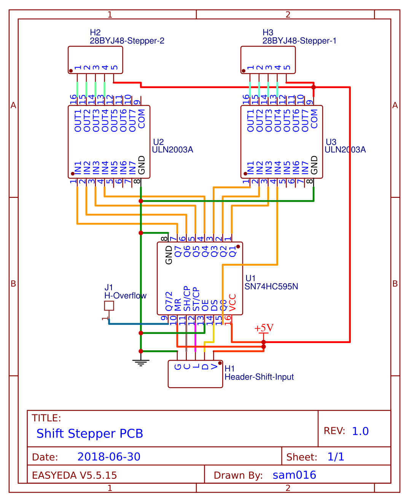
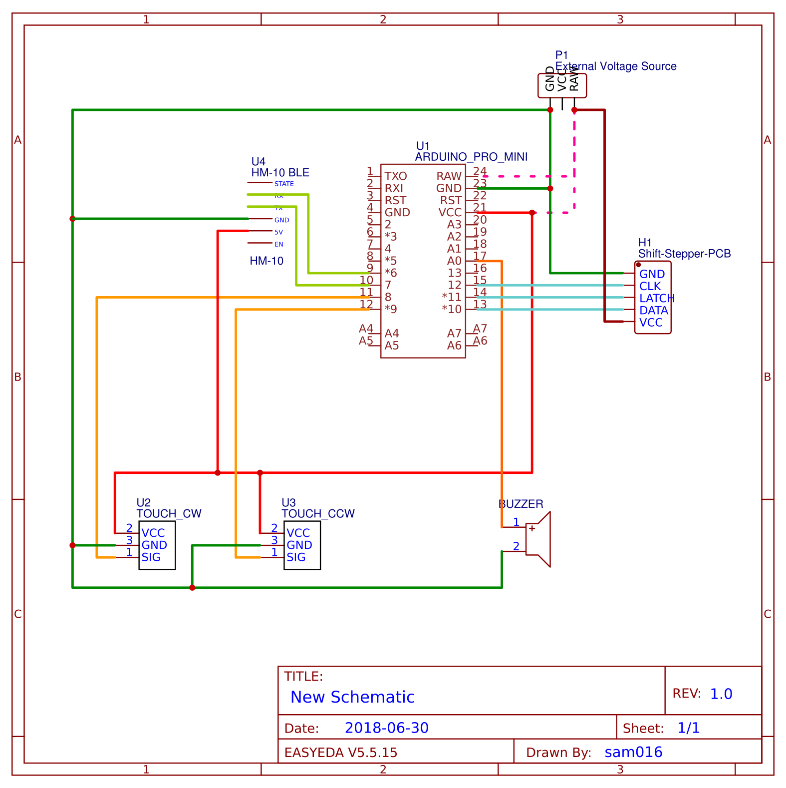

# room-mosk-net-controller
A project for room to control (pull up or drop down) mosquito net using arduino pro mini

## Components

1. [5V/16M Arduino Pro-Mini](https://www.banggood.com/Pro-Mini-ATMEGA328P-5V16M-Improved-Version-Module-For-Arduino-p-985618.html?rmmds=search)
1. 4 x [28BYJ-48 stepper motors](https://www.banggood.com/28YBJ-48-DC-5V-4-Phase-5-Wire-Stepper-Motor-With-ULN2003-Driver-Board-p-74397.html?rmmds=search)
1. 4 x ULN2003A
1. 2 x Shift register (SN74HC595)
1. 2 x Touch Module ([TTP223](https://www.banggood.com/2_5-5_5V-TTP223-Capacitive-Touch-Switch-Button-Self-Lock-Module-For-Arduino-p-1132664.html?rmmds=search))
1. 1 x [Buzzer module](https://www.banggood.com/3Pcs-3_5-5_5V-Standard-Passive-Buzzer-Module-For-Arduino-p-984075.html?rmmds=search)
1. 1 x [HM10 BLE module](https://www.ebay.in/itm/232389594527)

## Schematics

### 1. Shift-Stepper board
I have created a Protoype Soldered PCB (Shift-Stepper), which consists of

- 1 x Shift register
- and, 2 x ULN2003A to control 2 x Stepper motors

Following is the schematic for it

### 2. A Controller board
A controller board to control the direction (CW and CCW) of the motors via touch buttons and also by HM-10 BLE module

